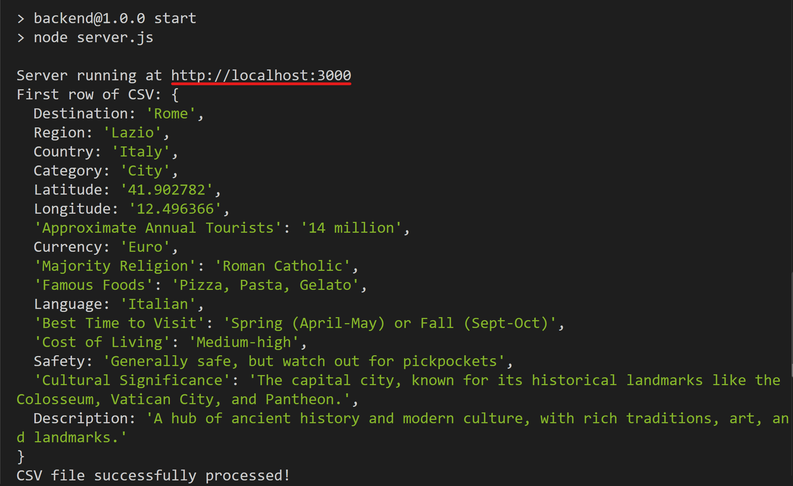
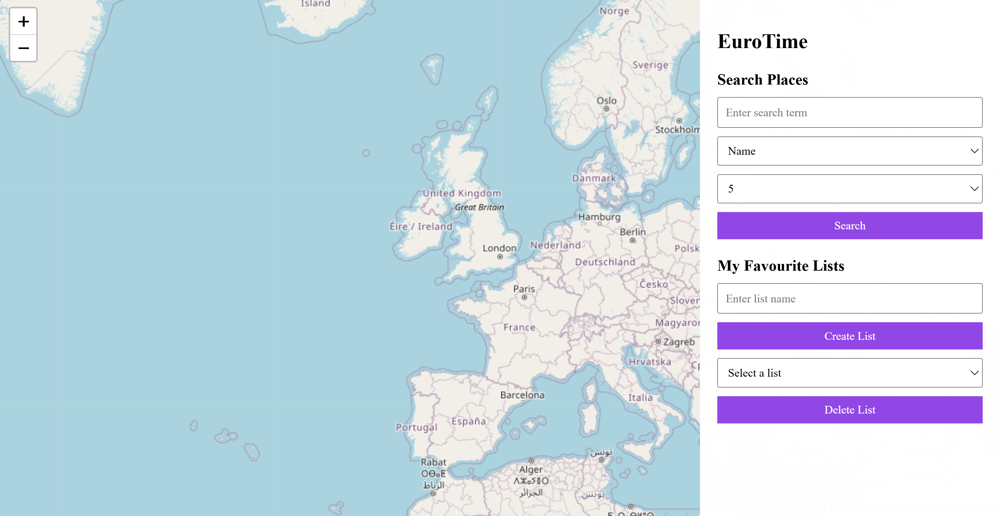
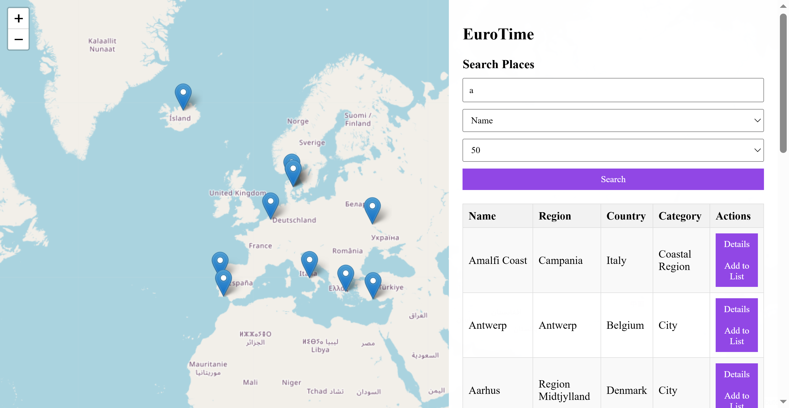
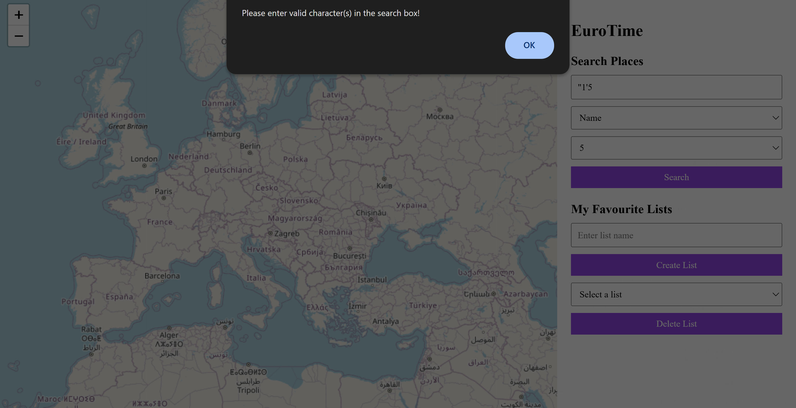
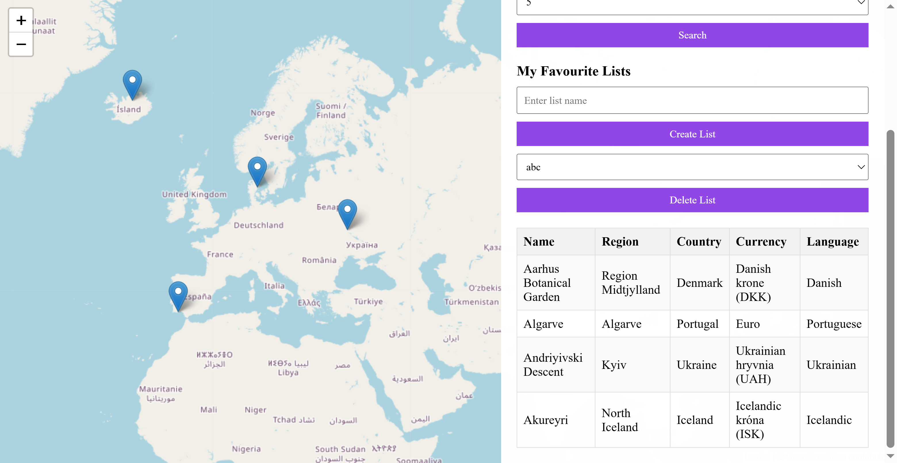
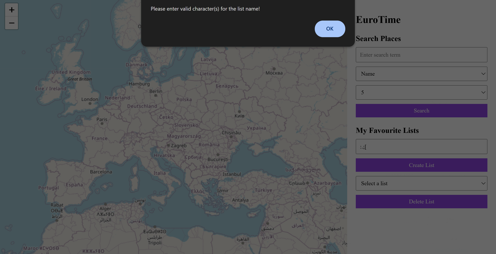

# EuroTime (Prototype #1️⃣)

## Descriptions 📋

**EuroTime** is a European **world map system** that can track your footsteps based on listing every flagged city.

This is the `first` prototype of **EuroTime**, which I implement a *customized* backend using [**Express**](https://expressjs.com/) for **backend framework**, [**OSM**](https://www.openstreetmap.org/) for **map database**, and a **comprehensive** European **destinations dataset** provided from the course instructor, which was obtained from [**Kaggle**](https://www.kaggle.com/datasets/faizadani/european-tour-destinations-dataset).

## Features ⚙

1. Able to **search results** based on name of the **city, region, or country**.
2. Able to **select how many** search results to **display** in maximum.
3. Display results as **table format**, and able to **see details** of each destination.
4. Able to **record** your chosen cities as **lists**, and display records as **table format**.
5. Able to **resize** the **side bar**, which contains searching and listing features.
6. Add **input sanitization** for searching and creating list names.

## Installation 📥

###### Unfortunately, GitHub Pages supports web deployment for frontend only, so I cannot deploy this prototype online as it contains a backend. As a result, you have to follow the steps I provided below carefully in order to try this application...

1. **Download the zip file** (`<> Code → Download ZIP`) to the location you wish and **unzip** it (`depends on what compression software you use`), ***or*** use this git command to **clone this repository** if you have [**Git**](https://git-scm.com/install/) installed:
```
git clone https://github.com/2h-5/eurotime.git
```

2. **Open the terminal** in the `server` folder, ***or*** **navigate to the `server` folder** using this command:
```
cd **location-you-store-the-app-folder**/eurotime/server
```

3. Run this command to install the required dependencies on the backend: (You have to install NPM following this [guideline](https://docs.npmjs.com/downloading-and-installing-node-js-and-npm).)
```
npm install
```

4. **Run the backend** in the terminal using this command:
```
npm run start
```

5. After the backend runs successfully, **you will see these outputs** in the terminal:



6. **Enter the link** from the outputs (In my case, it is "`http://localhost:3000`") **in your browser**, then you can finally play around with my app.

7. Once you finished playing this app, you have to **go back to the terminal**, and **press `Ctrl + C`** in order to close the backend.

8. Repeat **Step 2**, **Step 4 ~ 7** for the next time you want to try this app.

## Stories Behind the Work 📠

The early version of this prototype was my second last project from one of my university courses —— Web Technologies.

The course taught theoretical contents about how to build full stack applications. This project is applying those theoratical portion into application, where the coding part, especially server-side scripting, was self-learned.

Compared to my original project, what I have further developed/fixed are:

1. Make side bar to be resizable.
2. Fix errors on fetching destinations from the dataset.
3. Add different pop-up messages to handle different scenarios.

## Screenshots 📸

### Initial Stage



### Searching Functionality

 



### Listing Functionality

 

