###### Belows are my instructions and notes for every user who is curious about my work and wants to know more.

# EuroTime

## Descriptions 📋

**EuroTime** is a **mapping application** that can let users to **access detailed information** about travel destinations **in Europe**, users can also **create collections and ratings** for their **favourite destinations**.

You can also check out the other `branches` in this repo, where they may have different source codes and descriptions showing how I built this app following the **MVP (Minimum Viable Product)** strategy towards the final version. *Every prototype is runnable*, but newer version will have **new features**, which was added based on **testing** and **refining**.

## Features ⚙

1. A **homepage** to **introduce EuroTime** to new users, **including navigation bar** on the top and sample policies on the bottom.
2. **Login/register pages** for new users to get access to EuroTime, users can **update** their **password** after logging in.
3. Users can **search results** based on the name of the **destination, region, or country**.
4. Users can **select how many** search results to **display** in maximum.
6. Users can **add** their favourite destinations as **list collections** and **rate them**. (But users have to create a list and flag them to be public first!)
7. Users can choose to **see details** of their chosen destinations **based on the database**, or **search** their favourite destinations **by [**Google**](https://www.google.com/)**.
8. **Input sanitization** is enabled for searching and creating list names, this **prevents** users to type **special characters** in case of **causing issues** for the backend.
9. Users can try **admin roles** and access **admin's site manager** in order to **activate/deactivate** their accounts. (Admin account info is stored in `server/data/userinfo.xlsx`)

## Installation 📥

###### Unfortunately, GitHub Pages does not support web deployment for backend, so I cannot deploy this application online `(at no cost)`. Thus, if you want to try and test out my work, you have to follow the steps I provided below carefully...

**1.** **Download the zip file** (`<> Code → Download ZIP`) to the location you wish and **unzip** it (`depends on what compression software you use`).

**2.** **Open 2 terminals**, **one in** the **`server` folder**, the **other one in** the **`client` folder**.

> *If you do not know how to open terminals to specific folders*, you can **open 2 terminals in desktop**, then run these commands to **navigate each terminal**:
> 
> Navigate to the `server` folder: 
> ```
> cd **location-you-store-the-app-folder**/eurotime/server
> ```
> Navigate to the `client` folder: 
> ```
> cd **location-you-store-the-app-folder**/eurotime/client
> ```

**3.** Run the following command to **install** the **required dependencies** on both **client** and **server terminal**. (You have to install NPM first following this [guideline](https://docs.npmjs.com/downloading-and-installing-node-js-and-npm).)
```
npm install
```
> It may takes few more minutes to download all dependencies for frontend than the backend, please be patient!

**4.** After the installation is finished, **run the backend** in the **server terminal** using this command:
```
npm run start
```
> *If nothing is going wrong, the server terminal will display these outputs:*
> 
> 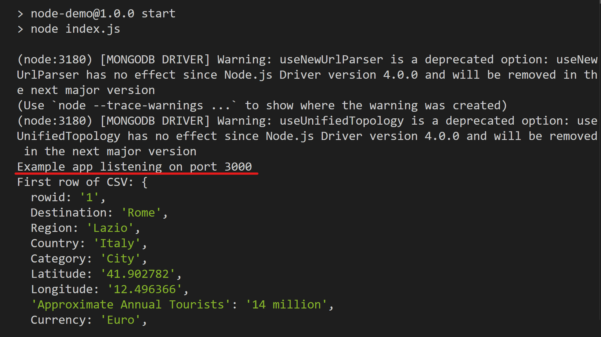
> 
> Then, **go to [localhost:3000](http:localhost:3000)** on your browser. *If you see "Hello World!" on the browser, this means your backend is running successfully!*


5. After the backend runs successfully, **run the frontend** in the **client terminal** using this command:
```
npm run dev
```
> *If nothing is going wrong, the client terminal will display these outputs:*
> 
> 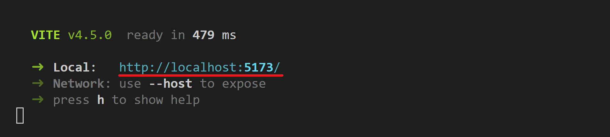
> 
> Then, **go to [localhost:5173](http:localhost:5173)** on your browser. *If you can see the homepage of EuroTime, this means your frontend is also running successfully, so you can **finally** try and test out this app on your own computer!*

6. Once you finished playing this app, you have to **go back to both client** and **server terminal**, and **press `Ctrl + C`** in order to close both the frontend and backend.

7. Repeat **Step 2**, **Step 4 ~ 6** for the next time you want to try this app.

## Stories Behind the Work 📠

This is **the first React project** and **the first full stack app I developed** individually! The original work was based on my final project from one of my university courses —— Web Technologies, but I have **further developed** more features and **fixed** more errors on top of it.

> ##### I will **leave the rest of "stories"** for each prototype **under its related `branch`** for those who wants to know more about what I have achieved on building this full stack app, and what specifically I have further developed and fixed in each prototype compared to the original coursework.

## Screenshots 📸

### Homepage

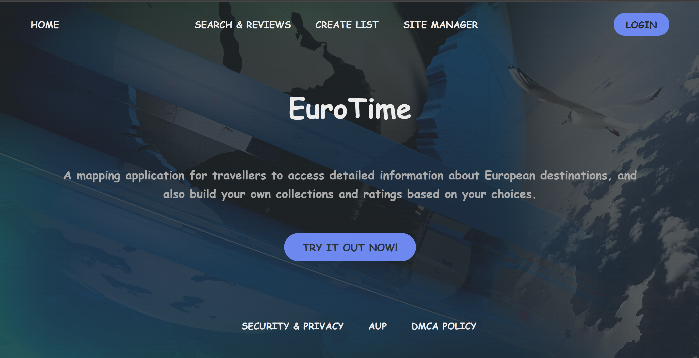

### Login/Register

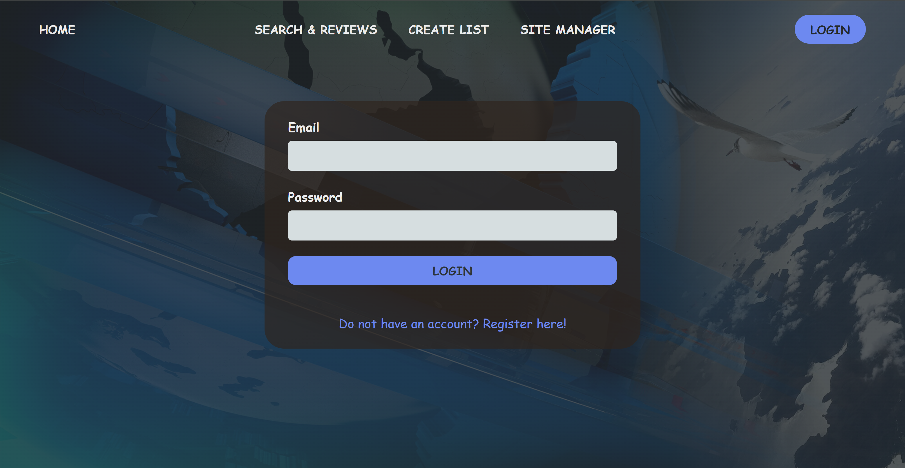

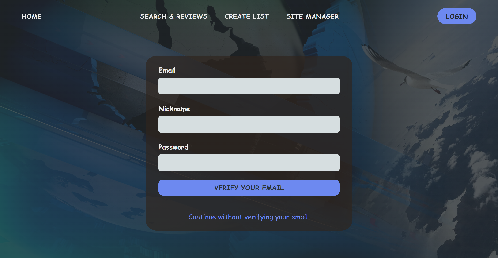

### Listing & Flagging

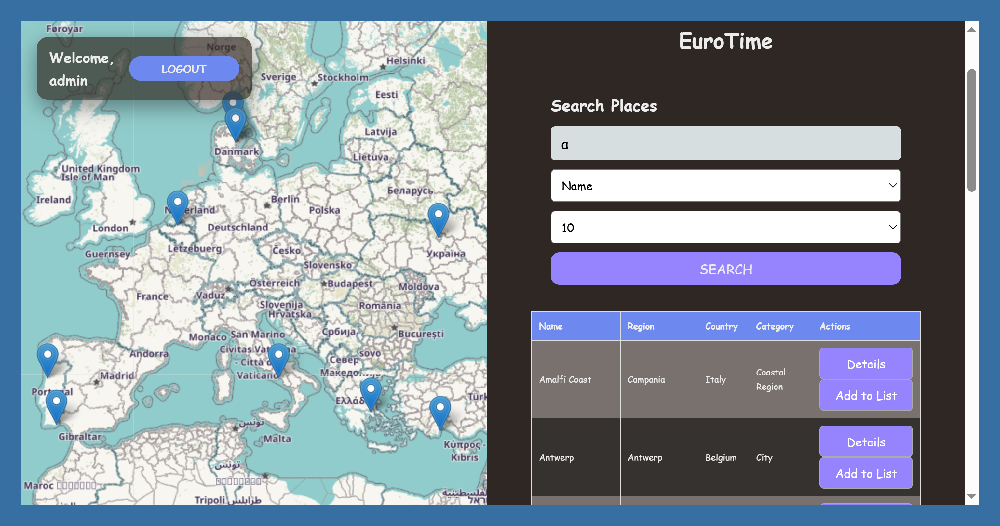

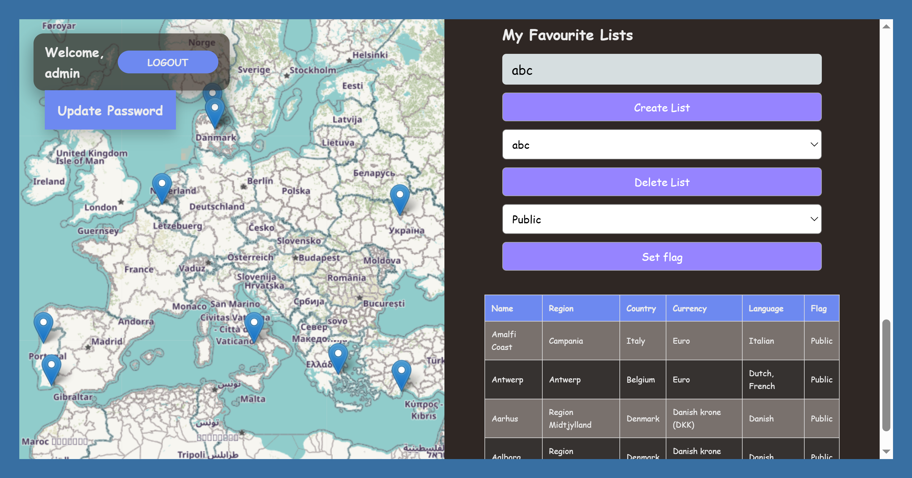

### Searching & Rating

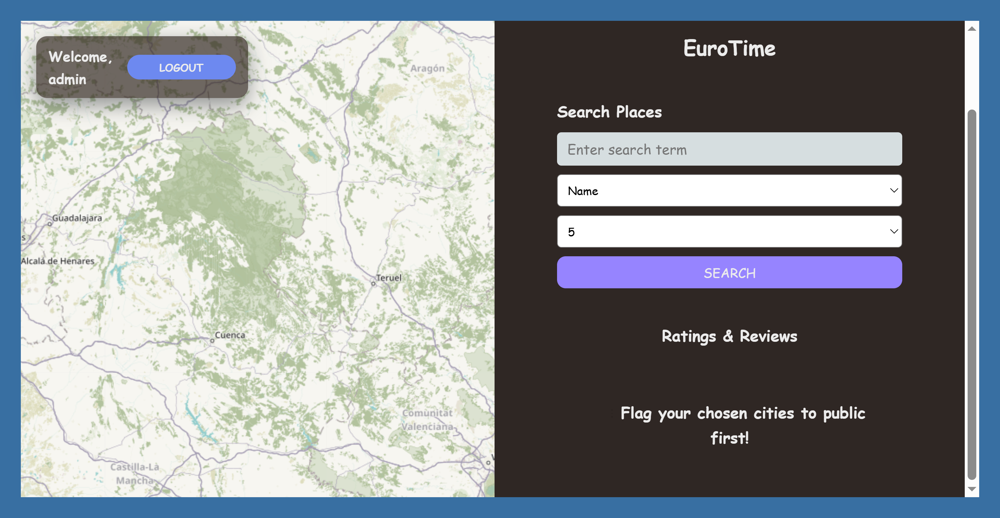

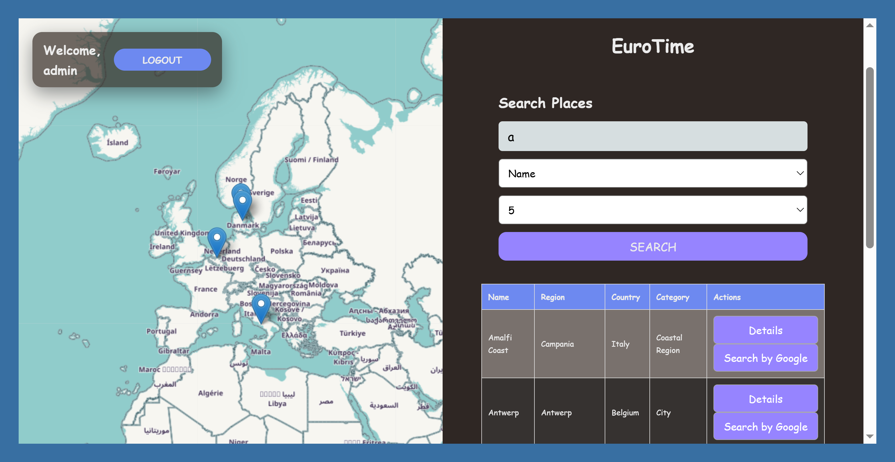

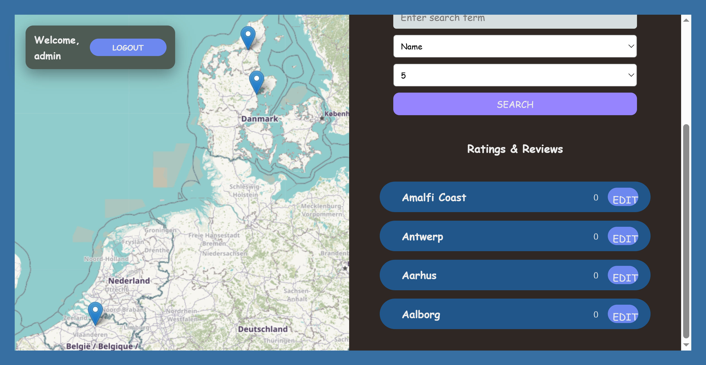

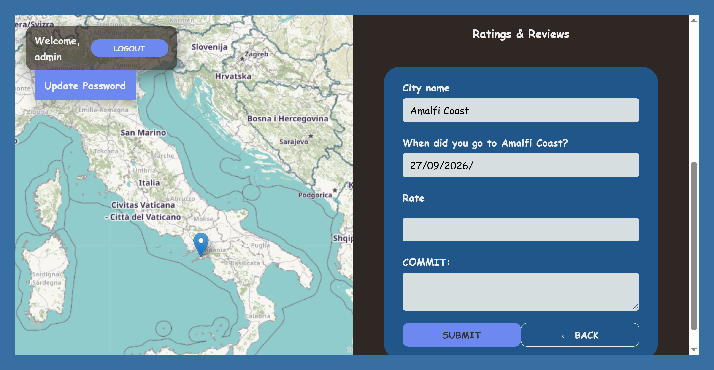

### Admin Privileges

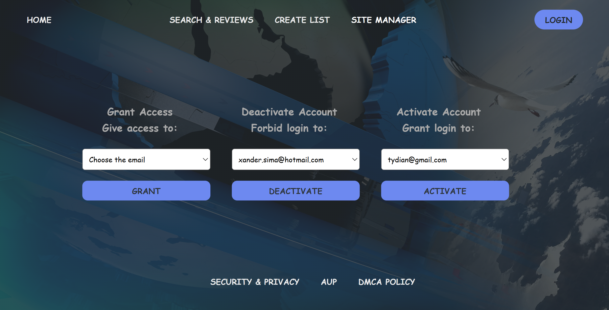
