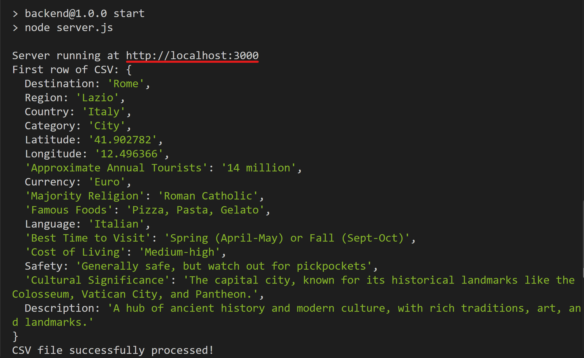
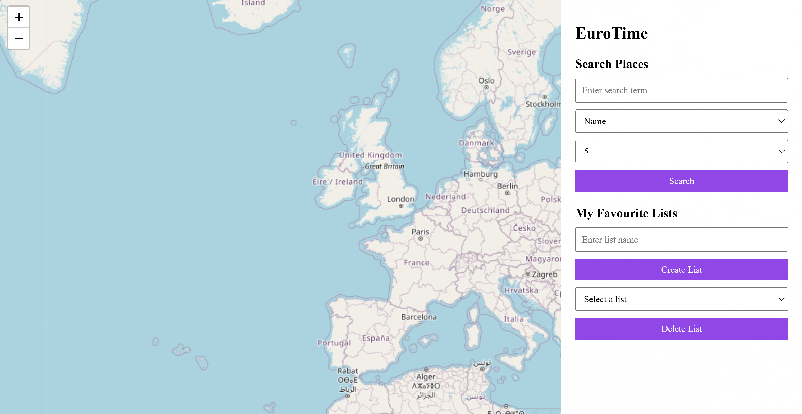
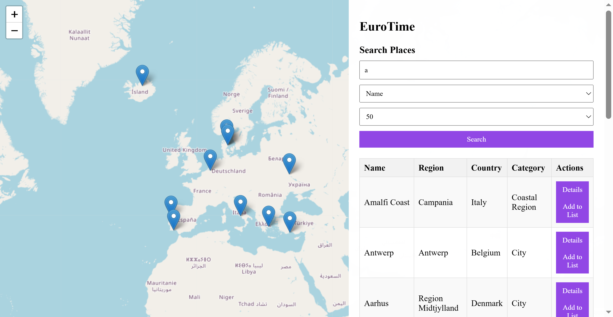
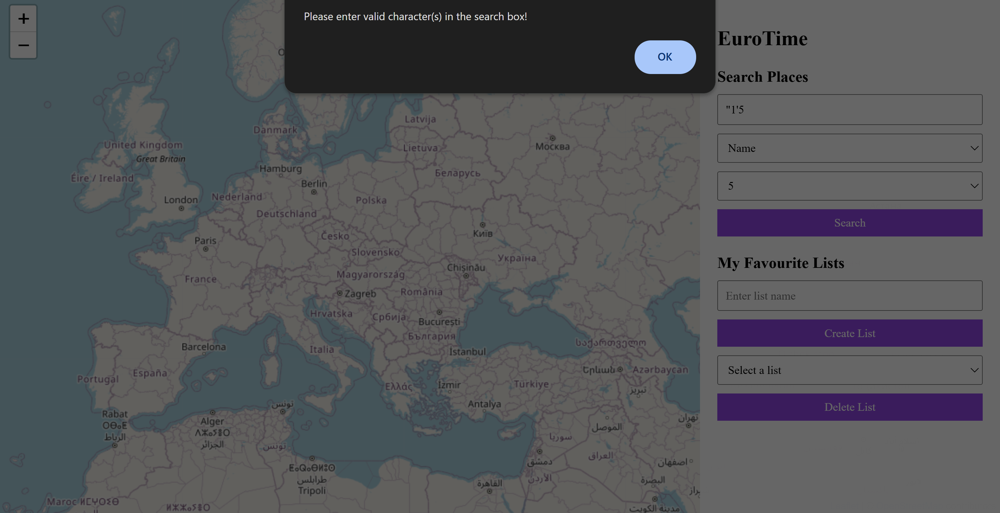
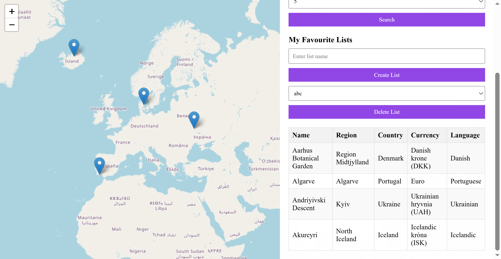
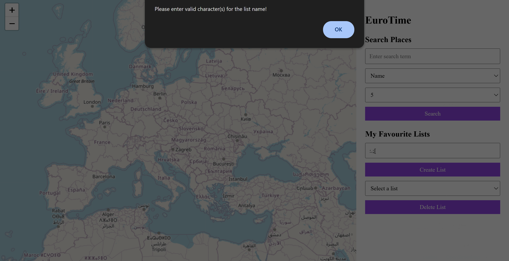

# EuroTime (Prototype #1️⃣)

## Descriptions 📋

**EuroTime** is a **mapping application** that can let users to **access detailed information** about travel destinations **in Europe**, users can also **create collections** of their **favourite destinations**.

This is the `first` prototype of **EuroTime**, which I implemented a ***handcrafted*** **server API** that was using [**Express**](https://expressjs.com/) for **backend framework**, [**OSM**](https://www.openstreetmap.org/) for **map database**, and a **comprehensive** European **destinations dataset** provided from the course instructor, which was obtained from [**Kaggle**](https://www.kaggle.com/datasets/faizadani/european-tour-destinations-dataset).

## Features ⚙

1. Users can **search results** based on name of the **city, region, or country**.
2. Users can **select how many** search results to **display** in maximum.
3. Users can see results as **table format**, and users can choose to **see details** for each destination.
4. Users can **add** their favourite cities as **list collections**, and users can see collections as **table format**.
5. Users can **resize** the **side bar** if they want to **see all** the **table columns thoroughly**.
6. **Input sanitization** is enabled for searching and creating list names, this **prevents** users to type **special characters** in case of **causing issues** for the backend.

## Installation 📥

###### Unfortunately, GitHub Pages does not support web deployment for backend, so I cannot deploy this application online `(at no cost)`. Thus, if you want to try and test out my work, you have to follow the steps I provided below carefully...

1. **Download the zip file** (`<> Code → Download ZIP`) to the location you wish and **unzip** it (`depends on what compression software you use`).

2. **Open the terminal** in the `server` folder, ***or*** **navigate to the `server` folder** using this command:
```
cd **location-you-store-the-app-folder**/eurotime/server
```

3. Run this command to **install** the **required dependencies** on the backend: (You have to install NPM following this [guideline](https://docs.npmjs.com/downloading-and-installing-node-js-and-npm).)
```
npm install
```

4. **Run the backend** in the terminal using this command:
```
npm run start
```

5. After the backend runs successfully, **you will see these outputs** in the terminal:



6. **Enter the link** from the outputs (In my case, it is "`http://localhost:3000`") **in your browser**, then you can finally play around with my app.

7. Once you finished playing this app, you have to **go back to the terminal**, and **press `Ctrl + C`** in order to close the backend.

8. Repeat **Step 2**, **Step 4 ~ 7** for the next time you want to try this app.

## Stories Behind the Work 📠

The early version of this prototype was my second last project from one of my university courses —— Web Technologies.

The course taught theoretical contents about how to build full stack applications. This project is to *apply those theoratical portions to make a real application*, where the **coding part**, especially server-side scripting like **ReSTful APIs** and **backend storage**, was self-learned and implemented.

Compared to the early version, what I have **further developed** for this version are:

1. Make the side bar to be resizable.
2. Update the layout of the side bar to be more intuitive.
3. Fix errors on fetching destinations from the dataset.
4. Add different pop-up messages to handle different scenarios.

## Screenshots 📸

### Initial Stage



### Searching Functionality

 



### Listing Functionality

 


